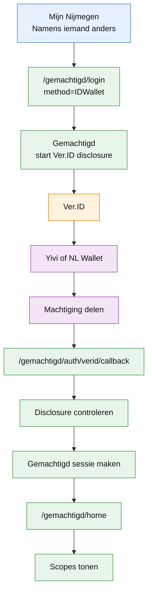
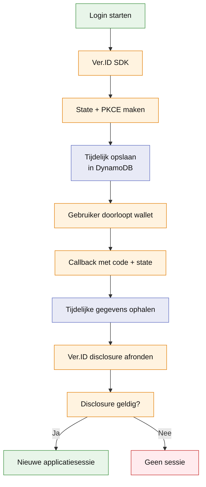

# Ver.ID disclosure flow

* [Ver.ID Node.js SDK](https://github.com/ver-id/verid-sdk-js-mono/tree/main/packages/node-client)
* [Ver.ID disclosure documentatie](https://docs.ver.id/integration/disclosures/introduction)

## Doel

Een bewindvoerder logt vanuit Mijn Nijmegen in via een wallet.

Mijn Nijmegen stuurt door naar:

`/gemachtigd/login?method=IDWallet`

Vanaf dat moment handelt mijn-nijmegen-gemachtigd de login af.

Voor IDWallet gebruiken we Ver.ID Disclosure. Ver.ID levert een gecontroleerde machtiging terug. Gemachtigd maakt daarna zelf een sessie.

## Hoofdflow



## Wat krijgen we uit de disclosure?

Ver.ID zet de gegevens uit verschillende wallets om naar dezelfde velden:

* identifier
* type
* clientBsn
* kvkNumber
* scopes

Gemachtigd hoeft daardoor niet te weten hoe Yivi of NL Wallet deze gegevens intern opslaat.

De ruwe disclosure wordt niet als sessie opgeslagen. Eerst controleren we de disclosure en zetten we deze om naar een intern AuthenticationResult.

## State en Proof Key for Code Exchange (PKCE)

Bij het starten van de disclosure maakt Ver.ID tijdelijke beveiligingsgegevens aan.

Proof Key for Code Exchange, voorkomt dat een onderschepte authorization code zomaar gebruikt kan worden.

De tijdelijke state en PKCE-gegevens moeten beschikbaar blijven tot de callback.

Daarvoor gebruiken we dezelfde DynamoDB-tabel als de Gemachtigd-sessies.



## Verdeling in de code

```text
app/login
  start de gekozen loginmethode

app/auth
  algemene authenticatie-interface

app/auth/verid
  Ver.ID disclosure, configuratie en tijdelijke cache

app/home
  leest de Gemachtigd-sessie

app/logout
  beëindigt de sessie
```

VerIdDisclosureFlow weet hoe Ver.ID werkt.

De algemene applicatie krijgt daarna alleen een AuthenticationResult terug. Daardoor kan later een andere loginmethode worden toegevoegd zonder de sessie- en homepagecode opnieuw te bouwen.

## Belangrijk

We loggen wel technische stappen, maar nooit:

* BSN
* KVK-nummer
* authorization code
* state of PKCE-verifier
* Ver.ID tokens
* sessie-id of cookie
